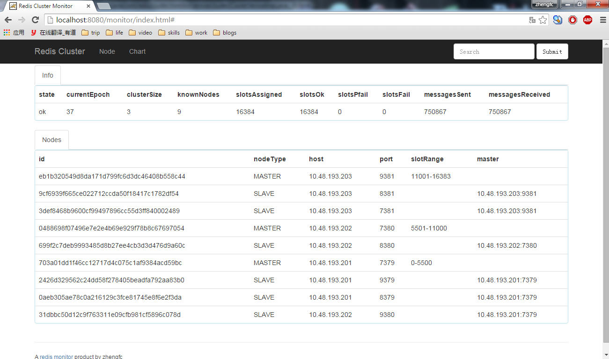
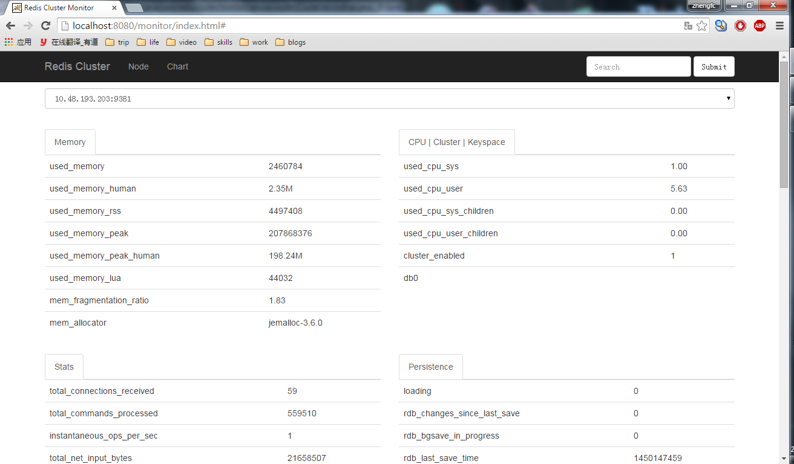

# redis-cluster-monitor
Redis3.0 Cluster Monitor

  1. git clone https://github.com/zhengfc/redis-cluster-monitor.git 
  2. change redis.properties for yourself
  3. make package
  4. run war on server(tomcat/jetty)

## cluster
  * cluster info, cluster slots, cluster nodes  
 

## nodes(You can change node with select)
  * info  
    * Memory, Cpu|Cluster|Keyspace
    * Stats, Persistence
    * Server, Clients|Replication

## chart | cmd will be coming...
key expire keysinslot slotsinnode...
